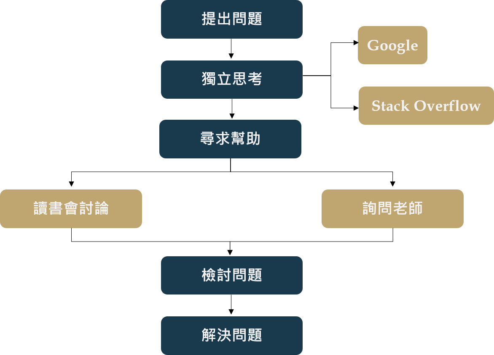

WeHelp 軟體工程師扶植計畫 | 申請資料

## 個人簡介

我是張心怡，我來自桃園，目前就讀國立高雄科技大學金融資訊系四年級，名義上是大四生，但我其實是一名預研生（即大四修研一課程，後年研究所畢業）。我是上大學後才接觸到程式設計，一開始就非常感興趣，因為我很喜歡具有邏輯和挑戰性的事物，但到大三下才開始積極學習，目前自學快一年，主要是透過網路資源和實體書學習，而我具備以下的程式能力。
- 程式能力：Python(Django)、HTML、CSS、JQuery
- 正在學習：JavaScript (自學)、Tableau(研一課程)

## 為什麼想成為前端、後端、或全端工程師？
起初自學程式設計時非常迷惘，因為我一直存在希望將金融與資訊結合的信念，而將兩個領域結合最直覺的做法是進行程式交易，但我在大三專題時發現這不是我感興趣的領域，因此我先以過去學過的內容作為自學出發點，結果在誤打誤撞之下架設了Django，開啟了我一系列的前端自學旅程。
在這段過程中，我發現我從來沒有那麼快樂的學習過！寫網站除了可以滿足我瘋狂coding的慾望，還能發揮我不成熟的美感，但由於我的本科還是金融，所以我的內心一直很掙扎；之後我開始在人力銀行尋找感興趣的工作，也不停詢問自己到底想要什麼，經過一番省思，最後我得出的結論是「我想成為前端工程師，而且我想做出與金融結合的網站」，我不確定會不會成功，但我一定要試試看。

## 為了成為軟體工程師，曾經做過什麼努力？
- 彭彭YouTube課程+ Leetcode+函式doc：複習Python、訓練邏輯、學習新函式，刷題一個月遇到資料結構而暫停。
- 深入淺出程式設計：建立程式邏輯與觀念、接觸GUI，大三專題使用GUI完成簡單的查詢系統介面。
- Python網頁程式交易APP實作:Web+MySQL+Django：想將GUI改成網頁，但過程中遇到MySQL架設問題，所以暫時捨棄MySQL改深入Django其他內容。
- PJCHENder Blog：使用JQuery學習動畫效果製作，例如：下拉選單、圖片輪播等。
- Django Girls：學到比較完整的Django架設過程，認識了Django預設資料庫SQLite、Font Awesome內嵌icon與PythonAnyWhere部署。
- 修改Django Girls作品：將上述的部落格作品變成多個分頁，使用模板繼承完成多個分頁跳轉。
- 架設餐廳網站：期望獨力規劃網站，雖然完成作品，但許多技術仍不成熟，例如：表單應用、資料庫等。
- MDN Web Docs (Django Web Framework)：學到更多SQLite應用，完成具有登入登出等功能的圖書館借書網站。
- Django 3從平凡到超凡Python架站實作演練：釐清在MDN不懂的應用，完成具有登入登出、留言案讚功能的網站。
- 架設履歷作品集網站：將目前所學集結成一個網站，除了基本的Web操作，也結合之前不熟悉的表單應用與SQLite。
- 彭彭YouTube課程+ MDN Web Docs (JavaScript)：由於之前只學了JQuery，所以現在把不足的JavaScript補上。
- Tableau：</b>目前在學校修的一門課，因為發現Tableau可以與Python結合甚至內嵌至HTML，所以納入學習的規劃。
- 作品連結：<a href="https://github.com/HsinI65018/django.git" target="_blank">Chang Hsin-I 履歷網站</a>

## 如果參與這個計畫，會怎麼安排學習時間？
由於目前是預研生，校內規定這段期間的修課學分上限為25學分，而我這學期已修15學分（五堂課），即下學期只需修10學分（三堂課），因此我有大量的時間可以參與這項學習計畫。
時間規劃：
  ```  
  參加訓練營→銜接碩士論文→尋找實習→求職

  第一階段：這段期間剛好遇到學期末，事情雖然比較多，但我一直都會利用課餘時間到圖書館學習（一周大約40小
  時，一下課到圖書館+沒上課整天待圖書館），而且我具備一點基礎能力，因此我相信我可以配合課程進度。
  第二、三階段：這段期間彈性許多，因此可以花更多時間在訓練營，扣除上課時間，預計一周可以有50小時以上的學習時間。
```
## 如果參與這個計畫，預期會碰到什麼困難？你打算怎麼解決它？
我最大的問題應該會出現在資料庫、API等後端應用，因為之前幾乎是沒有接觸過，前端雖然稍微研究過但仍然有很多需要精進的地方，尤其是JavaScript的應用，而我的解決方式是將目前自學期間的解決方法+預期加入後可能會有的學習資源。



## 是否有想要加入的軟體公司？為什麼想加入該公司？
我目前還沒有明確想加入的軟體公司，因為我認為我的技術還太生疏，仍有許多技術是不了解甚至沒聽過的，因此不敢好高騖遠；我傾向於先把技術練好再去思考這部分的問題，因為我認為要先腳踏實地把基礎打好才有選公司的資格。
    
## 想要對我們說的事情？
我真的非常想參加這個訓練營！看到訓練營直播時剛好是我的撞牆期，我開始疑惑我的方向是否正確，也對於自己想走的方向出現質疑，但看到直播的那一刻我非常興奮，因為我覺得我看到了一條明確的道路，我不僅有機會參與，時間安排上也能完美配合，雖然我離畢業還有一段時間，似乎不是很貼近招生需求…最後我想跟彭彭老師說聲謝謝，謝謝老師的教學影片，這對那時剛起步的我有很大的幫助，尤其終於搞懂什麼是class，希望未來能夠有機會繼續向老師學習，謝謝。
